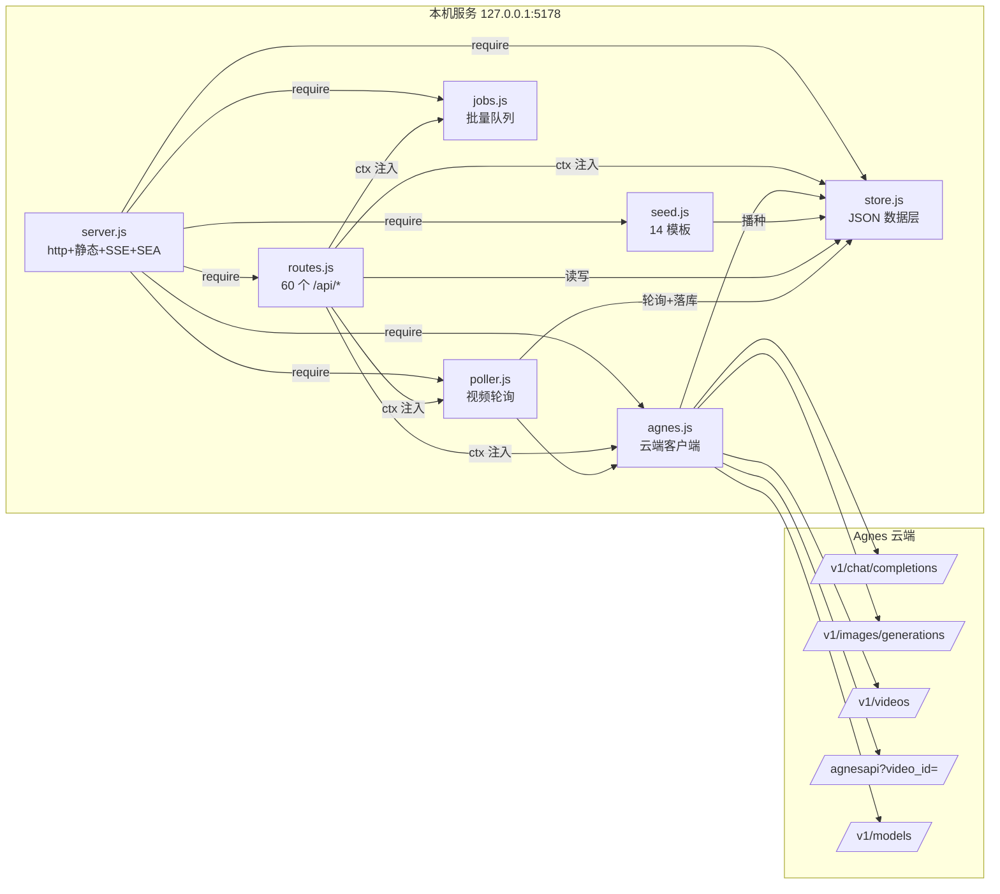

# Agnes 漫剧工坊 · 项目知识图谱

本目录是对 `agnes-manga-studio` 全库的结构化梳理，三个产物一套数据：

| 文件 | 用途 |
|---|---|
| `knowledge-graph.json` | **唯一数据源**：73 节点 / 177 边，机器可读，供文档、工具、后续分析消费 |
| `viewer.html` + `graph.data.js` | 交互式图谱：零依赖 Canvas 力导向图，**双击 viewer.html 即可打开**（file:// 无需起服务） |
| `../../tools/build-graph-data.mjs` | 从 JSON 重新生成 `graph.data.js`，并做引用完整性校验（悬空引用 / 重复 id / 孤立节点） |

```bash
# 改了 knowledge-graph.json 之后：
node tools/build-graph-data.mjs
```

Viewer 操作：拖拽平移 / 滚轮缩放 / 拖动节点 / 点击看详情（可跳转邻接节点）/ 双击聚焦一跳邻域 / 右上图例按类型过滤 / 左上搜索。

## 图谱模型

**节点类型**（`types`，配色与 viewer 图例一致）：

`entry 入口` · `frontend 前端模块` · `page 页面` · `server 服务进程` · `lib 后端模块` · `api API 资源` · `db 数据集合` · `storage 落盘文件` · `external Agnes 云端接口` · `concept 机制/约定` · `tool 测试/工具`

**边语义**（`kind`）：`import / require / 注入 / 路由 / 实现 / 调用 / 代理 / 轮询 / 读写 / 落盘 / 广播 / 测试 / 播种 / 打包 …`

## 一、进程与模块依赖（后端）



关键约束：API Key 只存 `settings.json`（前端只见脱敏值）；所有 Agnes 调用由本机 `agnes.js` 代发；`poller` 关掉浏览器也继续轮询，经 SSE 推给前端。

## 二、前端结构（原生 ESM，无构建）

```mermaid
graph TD
  H[index.html] --> A[app.js<br/>hash路由+state+EventSource]
  A --> P1[dashboard] & P2[projects] & P3[scripts] & P4[storyboards] & P5[images] & P6[videos] & P7[tasks] & P8[assets] & P9[settings]
  P3 & P4 -.->|"genText json_mode → extractJsonArray"| C[consts.js<br/>图标/枚举/repairJson]
  P1 --> P10[helpers.js<br/>head/picker/batchBar]
  A --> API[api.js<br/>{ok,data,error} 封装]
  A --> UI[ui.js<br/>toast/modal/setBusy]
```

## 三、创作链路与数据流（核心业务图）

```mermaid
graph LR
  PJ[(projects)] --> SC[(scripts)] --> SB[(storyboards)]
  SB -->|image_prompt| IA[(image_assets)] -->|linked_image_id| SB
  SB -->|video_prompt| VA[(video_assets)] -->|linked_video_id| SB
  SC & SB & IA & VA -.->|成败都记账| GT[(generation_tasks)]
  PT[(prompt_templates<br/>seed 播种)] -.->|{{变量}}表单| SC
```

单条链路：脚本页 `生成内容`（模板→json_mode 生成→容错解析→保存）→ 分镜页 `生成第 N 集分镜`（脚本→{shots:[...]}→批量落库）→ 批量补提示词 → 批量出图（jobs 队列 并发3，结果落 `assets/images/`）→ 批量出视频（串行提交防重复扣费）→ 任务中心（SSE 实时状态 / bind 补录 video_id / 下载落 `assets/videos/`）。

## 四、持久化布局

```
data/
├── db.json          # 8 集合主档（原子写 + .bak 自动回滚）
├── settings.json    # 含明文 Key —— 仅本机，永不回前端
├── models.json      # 模型目录缓存（TTL 24h）
├── assets/images/   assets/videos/   exports/
```

## 五、值得先读的"机制节点"（graph 中 type=concept）

| 节点 | 一句话 |
|---|---|
| JSON 约束解码 + 容错解析 | 生成走 `response_format=json_object`（4xx 自动降级），前端 `repairJson` 兜底坏引号/尾逗号，`extractJsonArray` 解包 `{shots:[...]}` |
| 视频轮询状态机 | 提交超时≠失败（可 bind 补录）；completed 无 URL → `video_url_missing`；未知状态不动只存档 |
| setBusy 加载态 | 长耗时按钮：禁用 + 秒表，防双击重复烧配额 |
| 原子写 + 自动备份 | tmp→rename，写前留 .bak，persist 串行队列 |
| 本机安全护栏 | 写操作 Origin 校验、safeResolve 路径钉死、文件名净化 |
| Node SEA 单文件 exe | 资源内嵌首启释放、portable 哨兵、ASSETS_VERSION 控制重释放 |

## 数据从哪里来（可复核）

- 路由表：`grep -n "^  on('" lib/routes.js`（60 条）
- 模块依赖：`server.js` 的 `libRequire`、`lib/*.js` 的 `require`
- 页面→API：各 `public/js/pages/*.js` 的 `api.*` 调用 + `api.js` 方法映射
- 落盘/外呼：`store.js` 持久化路径、`agnes.js` 的 URL 构造
- 机制节点：对应模块头部注释与实现（本图谱描述与代码注释同源）
